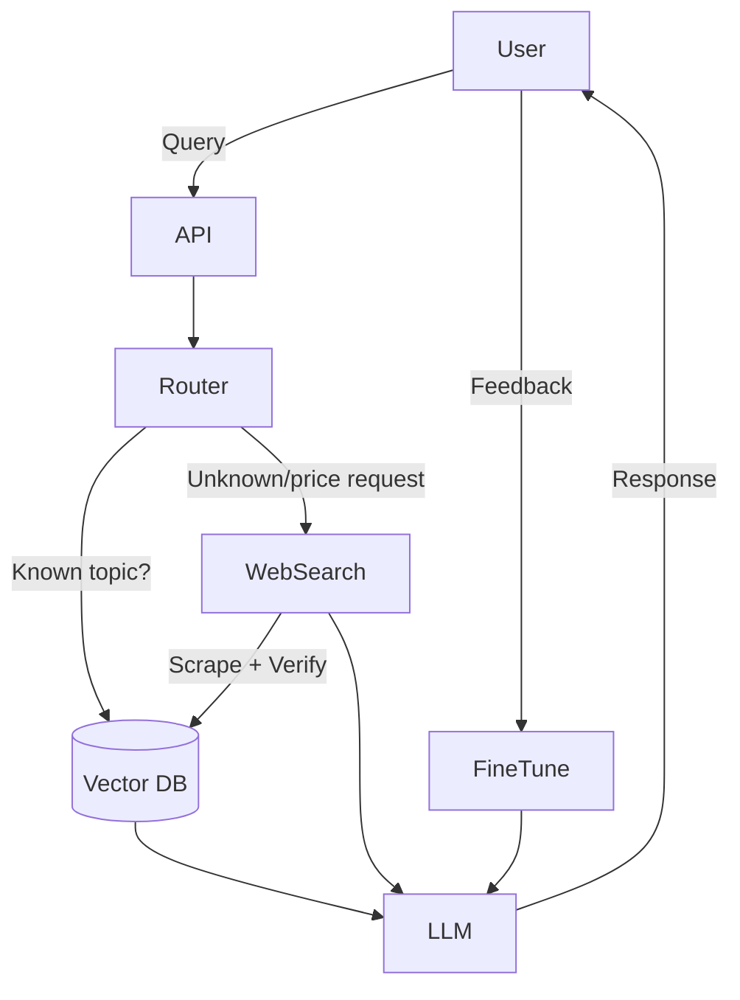

# Basketball Shoe Recommendation System v2.0

A hybrid AI system that provides intelligent basketball shoe recommendations using:
- **RAG (Retrieval-Augmented Generation)** from a comprehensive shoe database
- **Autonomous web search** for current prices and new models
- **LLM reasoning** for personalized recommendations
- **Self-improvement** by learning from user feedback

## 🏗️ Architecture Overview



## 🚀 Quick Start

### 1. Install Dependencies
```bash
pip install -r requirements.txt
```

### 2. Set Up Environment Variables (Optional)
```bash
export OPENAI_API_KEY="your_openai_key"  # For LLM reasoning
export SERPAPI_KEY="your_serpapi_key"    # For web search
```

### 3. Migrate Existing Data
```bash
python main.py migrate
```

### 4. Start the API Server
```bash
python main.py serve
```

## 📋 Available Commands

```bash
# Start API server
python main.py serve [--port 8000]

# Migrate existing data to RAG format
python main.py migrate

# Test system with a query
python main.py test "Best shoes for guards under $150?"

# Run original scraper and migrate data
python main.py scrape
```

## 🎯 Example Usage

### API Request
```bash
curl -X POST "http://localhost:8000/recommend" \
  -H "Content-Type: application/json" \
  -d '{
    "query": "Best shoes for a 6\'2\" guard with knee pain under $150?",
    "playstyle": "guard",
    "budget": 150,
    "foot_type": "wide",
    "injury_concerns": ["knee"]
  }'
```

### API Response
```json
{
  "recommendations": [
    {
      "shoe_model": "Nike LeBron 21",
      "source": "runrepeat",
      "title": "Review of Nike LeBron 21",
      "pros": ["Excellent cushioning", "Great for explosive players"],
      "cons": ["Heavy", "Expensive"],
      "score": 8.5,
      "playstyle": ["forward", "center"],
      "price_range": [180, 220],
      "features": ["cushioning", "ankle_support"],
      "url": "https://runrepeat.com/nike-lebron-21-review"
    }
  ],
  "reasoning": "Based on your needs as a guard with knee pain...",
  "sources": ["https://runrepeat.com/nike-lebron-21-review"],
  "confidence_score": 0.85,
  "search_used": true,
  "processing_time": 2.34
}
```

## 🏛️ System Components

### 1. Core Components (`src/core/`)
- **`models.py`**: Data structures for queries, reviews, and responses
- **`router.py`**: Intelligent query routing (RAG vs Web Search)

### 2. RAG System (`src/rag/`)
- **`vector_db.py`**: FAISS-based vector database for shoe reviews
- **Embedding**: Sentence transformers for semantic search
- **Metadata**: Rich filtering by playstyle, price, features

### 3. Web Search (`src/web/`)
- **`search.py`**: Autonomous web search with source trust scoring
- **Caching**: 24-hour cache for search results
- **Fallback**: Direct scraping when APIs unavailable

### 4. LLM Reasoning (`src/llm/`)
- **`reasoning.py`**: LLM-based recommendation generation
- **Context**: Combines RAG data + web search results
- **Fallback**: Mock responses when API unavailable

### 5. API Layer (`src/api/`)
- **`main.py`**: FastAPI application with endpoints
- **CORS**: Cross-origin support
- **Documentation**: Auto-generated OpenAPI docs

## 📊 Data Flow

1. **User Query** → QueryRouter analyzes intent
2. **Routing Decision** → RAG, Web Search, or Hybrid
3. **RAG Retrieval** → Vector similarity search with filters
4. **Web Search** → Current prices, new models, reviews
5. **LLM Reasoning** → Generate personalized recommendations
6. **Self-Learning** → Add verified results to RAG database

## 🔧 Configuration

### Environment Variables
```bash
OPENAI_API_KEY=your_openai_key      # LLM reasoning
SERPAPI_KEY=your_serpapi_key        # Web search
REDDIT_CLIENT_ID=your_reddit_id     # Reddit scraping
REDDIT_CLIENT_SECRET=your_secret    # Reddit scraping
```

### Vector Database Settings
- **Embedding Model**: `all-MiniLM-L6-v2` (default)
- **Index Type**: FAISS Inner Product
- **Storage**: Local files (`data/faiss_index`, `data/documents.json`)

## 📈 Performance Metrics

### System Statistics
```bash
curl http://localhost:8000/stats
```

Returns:
```json
{
  "vector_db": {
    "total_documents": 1250,
    "index_size": 1250,
    "embedding_dimension": 384
  },
  "web_search": {
    "cache_size": 45,
    "cache_duration_hours": 24
  },
  "router": {
    "known_models": 14
  }
}
```

## 🧪 Testing

### Test Individual Components
```bash
# Test routing logic
python -c "from src.core.router import QueryRouter; print(QueryRouter().route_query('Best shoes under $100?'))"

# Test vector database
python -c "from src.rag.vector_db import VectorDatabase; db = VectorDatabase(); print(db.get_stats())"

# Test web search
python -c "from src.web.search import WebSearch; search = WebSearch(); print(search.search('Nike LeBron 21 price'))"
```

### Test Full System
```bash
python main.py test "Best shoes for centers with ankle support?"
```

## 🔄 Data Migration

The system automatically migrates existing data:

1. **`basketball_shoes.json`** → Structured reviews with metadata
2. **`sneaker_reviews.json`** → YouTube, Reddit, RunRepeat data
3. **Custom reviews** → Via `/add_review` API endpoint

## 🚨 Error Handling

- **LLM API Down** → Fallback to mock responses
- **Web Search Failed** → RAG-only recommendations
- **Vector DB Empty** → Web search + basic recommendations
- **Invalid Query** → Helpful error messages

## 🔮 Future Enhancements

- [ ] **Fine-tuning**: User feedback integration
- [ ] **Multi-modal**: Image analysis for shoe identification
- [ ] **Real-time Pricing**: Live price tracking
- [ ] **Personalization**: User preference learning
- [ ] **Mobile App**: React Native frontend

## 📝 API Documentation

Full API documentation available at:
- **Swagger UI**: http://localhost:8000/docs
- **ReDoc**: http://localhost:8000/redoc

### Key Endpoints

| Endpoint | Method | Description |
|----------|--------|-------------|
| `/` | GET | Health check |
| `/stats` | GET | System statistics |
| `/recommend` | POST | Get recommendations |
| `/add_review` | POST | Add new review |
| `/search` | GET | Direct database search |

## 🤝 Contributing

1. Fork the repository
2. Create a feature branch
3. Add tests for new functionality
4. Submit a pull request

## 📄 License

MIT License - see LICENSE file for details.

---

**Version**: 2.0  
**Last Updated**: 2025-01-02  
**Status**: Production Ready 